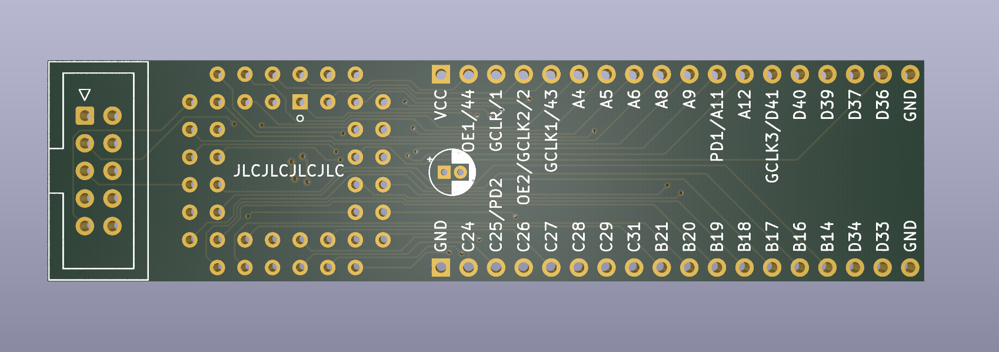

# ATF1504 Breakout

Breakout board for Atmel's AFT1504 and ATF1502 CPLDs in a through-hole PLCC-44 socket. The size is friendly for breadboard use, with two rows of holes left available on each side of the breadboard for wires to come in. A spot for an optional clock oscillator (SMD 7.5x5.0mm), connected to the first global clock input (GCLK1), is also provided.

## Board

## Schematic

## BOM

| Refs | Qty | Component | Description |
| ----- | --- | ---- | ----------- |
| C1 | 1 | 10u | Polarized capacitor, through hole D4.0mm P1.5mm |
| C2, C3, C4, C5, C6 | 5 | 100n | Ceramic capacitor, SMD 0805 |
| J1 | 1 | Atmel-JTAG-10 | Atmel 10-pin JTAG connector, 2x5 IDC |
| J2, J3 | 2 | Conn_01x18 | Generic connector, single row, 01x18 |
| U1 | 1 | ATF1504AS-xJx44 | Microchip CPLD, in through hole PLCC-44 socket |
| X1 | 1 | xMHz | Clock Oscillator, SMD 7.5x5.0mm (optional) |
